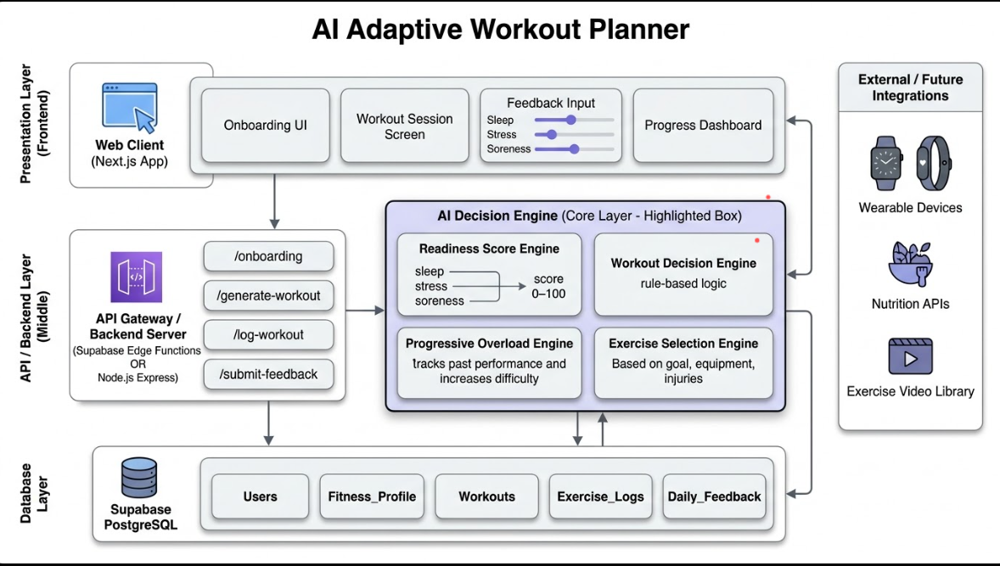

# AI Adaptive Workout Planner: Technical Architecture

## Architecture Diagram

## 1. System Overview

The **AI Adaptive Workout Planner** is a high-performance web platform designed to replace static fitness programming with **Dynamic Autoregulation**.

The system functions as a **closed-loop feedback mechanism**, processing:
- Subjective biometrics
- Objective performance data  

to optimize **daily training stimulus** and maximize **long-term results**.

---

## 2. Core Architecture Layers

### I. Presentation Layer (Next.js)

**Web Client:**  
A responsive Single Page Application (SPA) built with Next.js, optimized for high-speed client-side routing and performance.

**Key Modules:**
- **Onboarding UI:** Captures baseline metrics (Weight, Height, Injuries, Equipment)
- **Workout Session Screen:** Real-time logging interface with local state persistence
- **Feedback Input:** Normalized sliders (1–10) for Sleep, Stress, and Soreness
- **Progress Dashboard:** Visualizes historical strength trends and recovery metrics

---

### II. API / Backend Layer (Supabase Edge Functions)

**API Gateway:**  
Routes client requests and manages server-side business logic.

**Serverless Architecture:**  
Uses Supabase Edge Functions for low-latency execution and high scalability.

**Primary Endpoints:**
- `/onboarding` → Initializes the user's starting profile  
- `/generate-workout` → Constructs baseline session logic  
- `/log-workout` → Records set-by-set performance data  
- `/submit-feedback` → Processes biometrics and triggers session pivot  

---

### III. AI Decision Engine (The Intelligence Core)

This layer acts as the system’s **“Brain”**, composed of four sub-engines:

#### 1. Readiness Score Engine
- Calculates daily **Rate of Perceived Preparedness (RPP)**
- Based on sleep, stress, and recovery inputs

#### 2. Workout Decision Engine
- Applies rule-based heuristics
- Dynamically adjusts:
  - Intensity
  - Volume

#### 3. Progressive Overload Engine
- Evaluates historical performance (volume/tonnage)
- Ensures incremental strength progression:

\[
Intensity_{n+1} > Intensity_n
\]

#### 4. Exercise Selection Engine
- Handles **Dynamic Swapping**
- Substitutes exercises based on:
  - Active injuries
  - Goal alignment
  - Equipment constraints

---

### IV. Database Layer (Supabase PostgreSQL)

A relational schema optimized for **time-series performance tracking**.

**Primary Tables:**
- `Users`
- `Fitness_Profile`
- `Workouts`
- `Exercise_Logs`
- `Daily_Feedback`

**Data Integrity:**
- Enforced using **PostgreSQL Foreign Keys**
- Links feedback with performance outcomes for deep analysis

---

## 3. Detailed Data Flow & Execution

### The Adaptive Feedback Loop

1. **Ingestion:**  
   User submits subjective biometrics via feedback sliders

2. **State Retrieval:**  
   API fetches:
   - `Fitness_Profile`
   - Planned workout

3. **Processing:**  
   AI Decision Engine evaluates:
   - Current readiness
   - Historical performance

4. **The Pivot:**  
   If readiness is low:
   - Workout is automatically modified  
   - Example:
     - Barbell Squat → Leg Press

5. **Logging:**  
   - User logs workout performance
   - Stored in `Exercise_Logs`
   - Feeds next cycle of progression

---

## 4. Technical Motivation & Tradeoffs

### SQL (Supabase) vs NoSQL

**Why PostgreSQL (Supabase)?**

Fitness data is inherently **relational**:

- A **Set** → belongs to an Exercise  
- An **Exercise** → belongs to a Workout  
- A **Workout** → belongs to a User  

**Advantages:**
- Strong relational integrity
- Efficient analytical queries  
  - Example: *Performance trend vs Sleep quality*

---

### Hybrid Biometric Model

Supports:

- **Manual Input (Sliders)** → Accessible to all users  
- **Future Wearables Integration:**
  - Apple Health
  - Garmin
  - Oura  

**Benefit:**
- Works today
- Scales to **zero-input tracking** in future

---

## 5. Security & Risk Mitigation

### Injury Safeguards
- Exercise Selection Engine enforces **hard constraints**
- Example:
  - No overhead movements for shoulder injuries

### Data Privacy
- Secured using **Supabase Row-Level Security (RLS)**
- Ensures:
  - User-level data isolation
  - Secure biometric storage